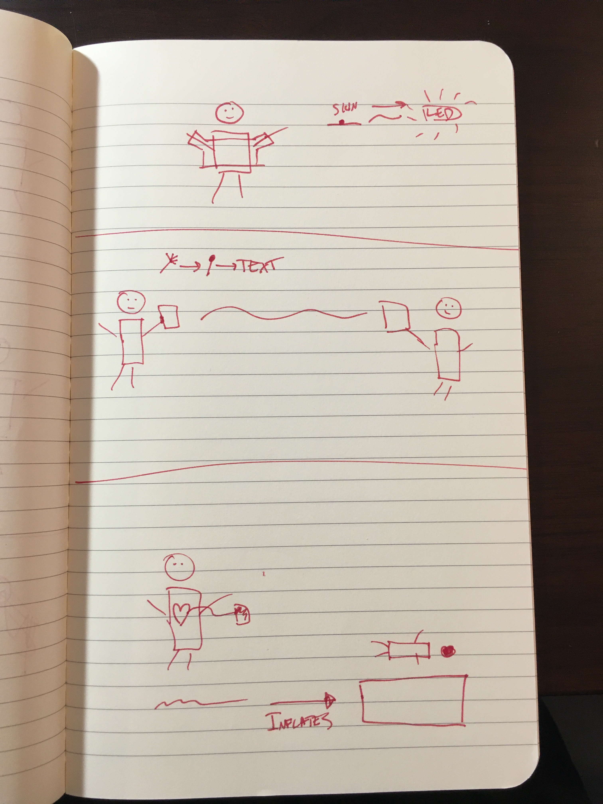

## Week 5 - Oct 26-30
This week, a few sketches, more literature, precising an interaction.

[Blair's post](/posts/blair_post_wk5.md)

#### Links and literature
- [Gaver's and Bowers' Annotated Portfolios](https://interactions.acm.org/archive/view/july-august-2012/annotated-portfolios)
- [Devendorf's Making Design Memoirs: Understanding and Honoring Difficult Experiences.CHI '20](https://dl-acm-org.offcampus.lib.washington.edu/doi/10.1145/3313831.3376345)
- [Devendorf's Entangling the Roles of Maker and Interpreter in Interpersonal Data Narratives: Explorations in Yarn and Sound. DIS '20](https://dl-acm-org.offcampus.lib.washington.edu/doi/10.1145/3357236.3395442)
- [Devendorf's "I don't Want to Wear a Screen": Probing Perceptions of and Possibilities for Dynamic Displays on Clothing. CHI '16](https://dl-acm-org.offcampus.lib.washington.edu/doi/10.1145/2858036.2858192)
- [Liu's Design for Collaborative Survival: An Inquiry into Human-Fungi Relationships. CHI '18](https://dl-acm-org.offcampus.lib.washington.edu/doi/10.1145/3173574.3173614)
- [Andersen's The Magic Machine Workshops: Making Personal Design Knowledge. CHI '19](https://dl-acm-org.offcampus.lib.washington.edu/doi/10.1145/3290605.3300342)
- [Blythe's Imaginary Design Workbooks: Constructive Criticism and Practical Provocation. CHI '18](https://dl-acm-org.offcampus.lib.washington.edu/doi/10.1145/3173574.3173807)
- [Boehner and al. How emotion is made and measured. (2007)](https://www.dourish.com/publications/2007/emotion-ijhcs.pdf)
- [Fannie Liu & Andrés Monroy-Hernández | Expressive Biosignals: Lightweight Social Cues for Social Connection | July 31, 2019](https://vimeo.com/361315913)

#### Sketches
   
Gab's sketches. From this lot, we decided to explore the "autoportrait" idea further in a short write up.

   
Blair's sketches. We decided to explore the "biosignal text messaging" idea further in a short write up, as well as incorporating the "biosignal synthesizer"'s exposing of the model parameters.

## Resources
- [Google Drive](https://drive.google.com/drive/u/0/folders/0ANOdHyxe8_6lUk9PVA)
- [Github markdown editor for this page](https://github.com/bsubbaraman/ABSR/edit/gh-pages/README.md)
