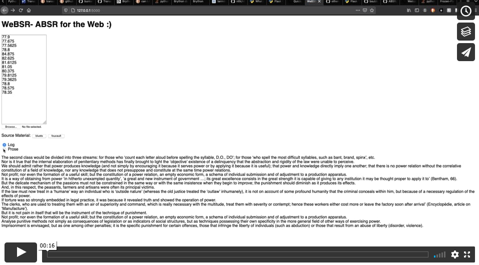

## Misc Thoughts
- in testing, will we be wearing out of the home? if so, do we need to log to e.g. SD card while out of WiFi range (or is there a different way for continuous logging)? 
- timescales: how often should biomeasurements taken? another way to ask that question: how long do we want the log/narrative to be? is there control over this via wristband, or would this be processing options after the fact? (you can never get more data after the fact, so I'm tempted to take lots of data up-front and then play with timescale after; after a week you might average each day's measurements to create a week-long narrative. would also be a fun interaction to make a week long narrative using only a specific time range- what does the week long narrative look like using only my workday (9-5) data, as opposed to my morning or evening data?)
- thinking about source materials: perhaps tangential to the main action items to get done, but the 'source material' might also be your Twitter Feed; could pull in recent tweets from you feed and the narrative becomes your social media feed filtered through your biodata.
- ^ i think you can also get access to your google search history and use that. my thought with these is to have an option that moves away from letting a single other person (i.e. the author of the text) 'speak' for your body.

## WeBSR :)
I have basically no experience with web dev... so obviously the best decision was to bring ABSR to the web: thus, WeBSR (or maybe now it's the WeBodyTeller?). This is mostly just to get off the command line a bit, & makes for easier reading & re-formatting of the logs. I don't really know javascript and previous code was python, so I tried out [Flask](https://flask.palletsprojects.com/en/1.1.x/), a python web framework. (note that this is not for storing and sharing personal logs with others, but maybe it could be?). Didn't bother reimplementing realtime logging since we'll soon be moving to WiFi over Serial, but the result is this ugly but semi-functional site:

