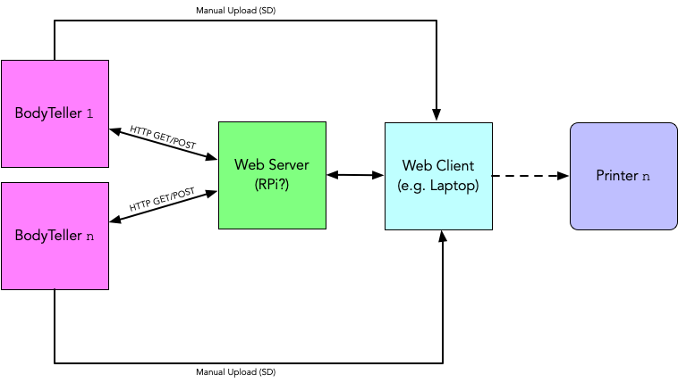
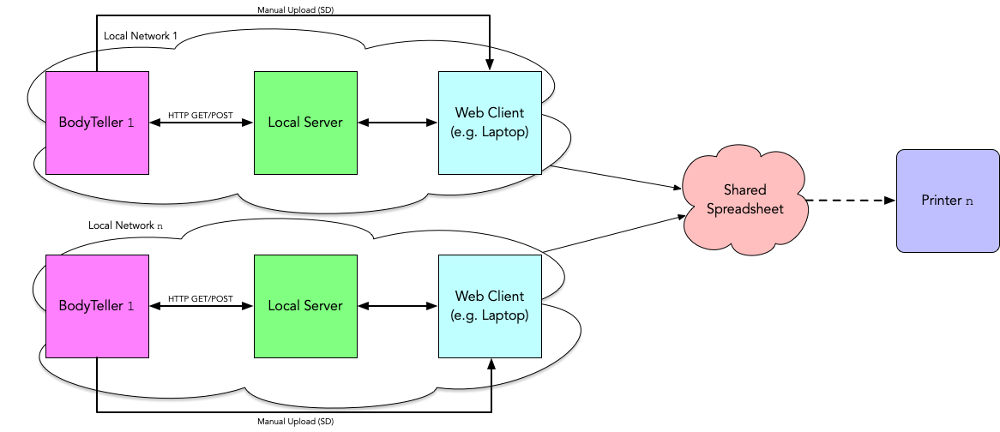

## Dev Progress
Our schedule says for this week we'd like off-the-shelf biosensor to text... this is more or less happening. I have a seeed studio GSR sensor which ended up being pretty much plug-and-play. I also continued updating the web ui with the command-line functionality from before (pick the 'easing function', etc), so the web can do all the command line can do except for realtime logs. I wanted to finalize how we're getting data to server before I move forward on this!

I also dusted off an Arduino Uno w/ WiFi to send the GSR to the web server. The code is different than the ESP8266, but I wanted to experiment with receiving POST data on the web server. This baseline functionality works, but I'll sync up with Gabrielle to see how these parts come together!

## Future Progress
I like to make block diagrams to think through deployment of projects, so here's a a couple quick (and probably incorrect :) looks at what of the use of our BodyTellers *might* look like.

<figcaption>Fig 1: server is ~public~</figcaption>

Maybe the most significant implication of this diagram is that the server (e.g. I have an old Raspberry Pi I'm not using) is public on the web. This would make it easy for us (or others) to view & share each other's logs at any point. It also means only one server running - but also means maintaining that one server if it goes down/etc. Alternatively, we could each launch our own server:

<figcaption>Fig 2: we each launch our own local server</figcaption>

Launching local servers for processing would make things quicker & more customizable on our ends, but probably not so good if we want to e.g. give more people BodyTellers to use. Also means we'd have to each have a server running on our laptops (or an rpi or something) at all times.

There's probably more/better way to set these things up, but this is some of my thinking around it. I also don't completely know how printing works into this yet hence the dotted line (are we thinking [mini thermal printers](https://www.adafruit.com/product/600) or print to actual printers in each others' homes?). 

## Misc Thoughts
- Noura Howell's 'Ripple' had a push-button for manual override, which allowed wearers to turn on the lights of their garment. Might think about a button like this on BodyTeller, with the text decorated differently in some way? This also feeds into questions about logging frequency and the extent to which we give ourselves control over the frequency.
- (If we're using mini thermal printers) I'm not totally sure how they work, but a note to self to factor plugging this in to our microcontroller when considering enclosure.
