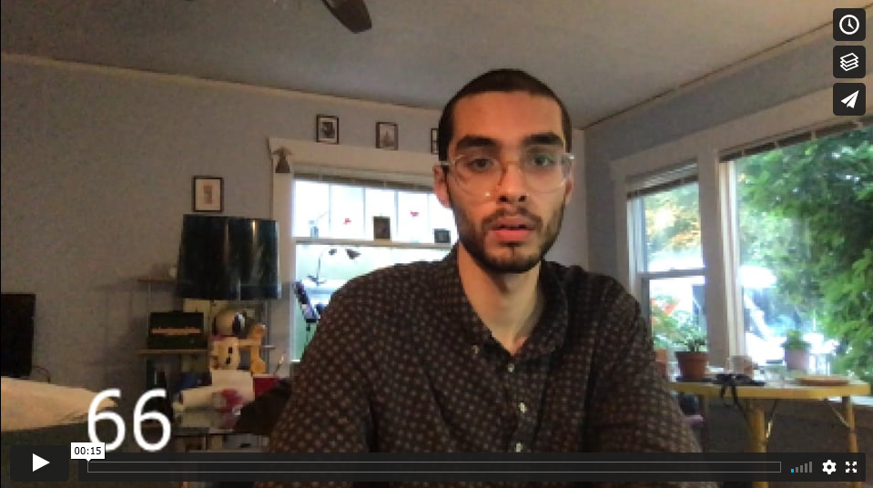

Blair Subbaraman

Last Edited: 2020.10.05

## Possible Research Questions
Some rapid-fire RQ ideas. Not necessarily intended to be tackled all at once, or at all :)
- How can biosensing devices foster interpretation & communication not just between person and device, but also with others?
- How does text as a representation of biodata affect impression and interpretability?
- How can biodata foster long-distance intimacy?
- How can alternative (i.e. non-numerical) representations of biodata foster critical refection on the body as a site of political contestation?

## Fabrication First Steps!

I am waiting to get access to the Make lab to gather more physical computing materials (Jane is back today (11/5 so this will happen soon :). I didn't have enough components to throw together a biosensor. But! I found that [heart rate can me measured from RGB video from a webcam](https://ep.liu.se/ecp/129/002/ecp16129002.pdf). This method has been implemented [here](https://github.com/habom2310/Heart-rate-measurement-using-camera). I decided to explore this a bit to experiment with interaction flow, even if the sensing device will change significantly.

### Zoom Biosensing
Using a webcam to monitor heart rate makes image filters an easy way to represent the data. Moreover, in establishing a context for this mini investigation, I wanted to get this webcam filter to Zoom. Zoom has become synonymous with social interaction during COVID. I wanted to play with 'biofeedback at a distance' or [long distance intimacy](https://alumni.media.mit.edu/~jofish/writing/io-chi-short-paper.pdf) in this context. Zoom is perhaps an interesting site to explore the ways in which biodata is leveraged for surveillance during the pandemic, i.e. [during exams](https://www.forbes.com/sites/zakdoffman/2020/04/24/no-lockdown-exams-sorry-kids-this-creepy-webcam-tech-lets-you-sit-them-at-home/?sh=4f5393c45cc5) to track eye gaze.

#### What I did
I added an OSC output stream to the above heart rate code which I consume in [TouchDesigner](https://derivative.ca/) (a realtime interactive multimedia software). I added a simple pixelation filter that is controlled by the incoming heart rate data: higher heart rate --> more pixelation. This can be passed over to a virtual camera for use in Zoom. So, the system here looks like:

Webcam In [Python] --> *Heart Beat Processing* --> OSC Out [Python] --> OSC in [TD] --> *Image Processing* --> Syphon Out[TD] --> Syphon In [CamTwist]

where I can use CamTwist for my Zoom webcam. Here's a video:

#### What I learned
- Biodata isn't clean! I think even DIY physical sensors might be more reliable than the RGB webcam monitor I tried, but there's a lot of wild jumping around. There's definitely some design/aesthetic choices to be made about 'cleaning' & 'smoothing' the data
- I added the numerical heart rate to the image just to see when the code crashed, but I don't like having the number there. At the Biodata as Material workshop this morning, Noura said something I really liked: when doing a biosensing project, she tried to never have the data in something resembling a csv file, instead opting to i.e. have sweat/skin conductance directly alter the brightness of an LED. It's an interesting problem to negotiate starting out by getting a strong biosignal & wanting to move away from the standard numerical data stream asap.
- In the video, I covered my face with my hand to 'trick' the monitor into thinking my heart rate shot up. It was fun to play around with these tricks (changing the lighting, covering my face, breathing deeply) as well as trying things like jumping jacks to actually raise my heart rate to see how 'good' a detector it was.
- While I have no idea how accurate the data here is, coming up with a mapping for the image pixellation was also a positive experience. I learned a little bit about my own measured heart rate (55 bpm seemed to be the lowest it went), the range it generally stayed in, and was able to play with the amount of pixelation that felt right to me at various heart rates.
